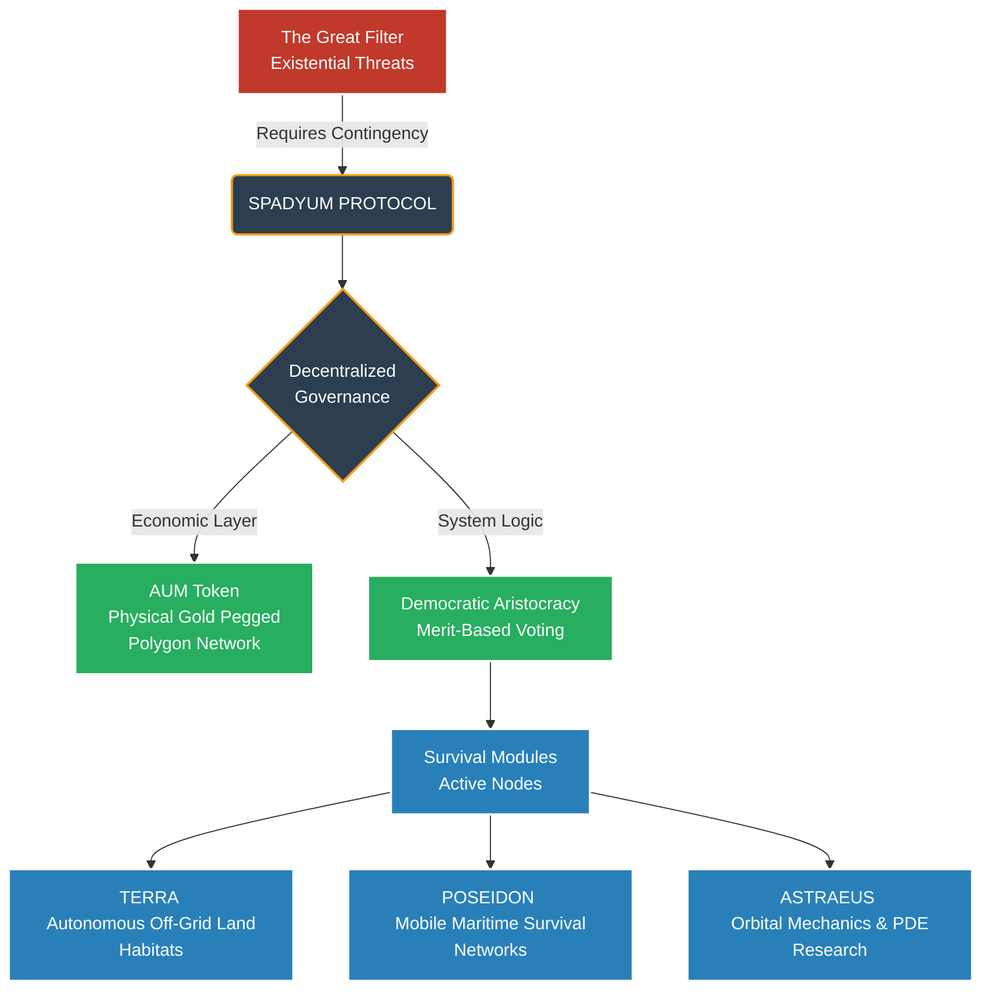

# SPADYUM: The Decentralized Insurance of Humanity and Global Civilization Network (Litepaper v1.0)

🌐 **Official Website & Citizenship Portal:** [spadyum.com](https://www.spadyum.com/)

> *"If the universe is so old and vast, where is everybody?" (The Fermi Paradox)*
> 
> The potential for a civilization to destroy itself (The Great Filter) has shifted from a historical theory to a daily risk. While the multi-trillion-dollar war economy wastes humanity's potential on destruction, Spadyum is a **supranational, decentralized, open-source project** designed to back up civilization, make peace profitable, and build an interstellar future.

## 1. The Vision: Why Are We Here?
The capitalist system's sole focus on profitable ventures and the political polarization fueling investments in weapons of mass destruction have trapped our planet in a fragile state. Spadyum is not a dormant bunker or a doomsday project waiting for a catastrophe. On the contrary, it is an active "Movement for Good" that works for the entire world in times of peace, funding scientific research and safeguarding human heritage (DNA, seed banks, digital libraries) by encrypting it across decentralized nodes.

## 2. System Architecture: A Three-Pillar Civilization
Spadyum is not merely a digital network; it is a modular engineering marvel taking root in the physical world and reaching into space.

* **Project Terra (Land):** Terrestrial safe habitats and autonomous production facilities. This module includes open-source designs for self-sustaining agricultural and energy systems.
* **Project Poseidon (Sea):** Fully autonomous and sustainable energy and habitat concepts on the open seas, harnessing the untapped potential of the oceans. *(Advanced maritime and stabilization engineers needed).*
* **Project Astraeus (Space):** Spadyum's ultimate expansion module. Unmanned exploration vehicles and rocket propulsion systems. This is our open-source R&D hub focusing specifically on *Pulse Detonation Engine (PDE)* mechanics and Gimbaled Thrust control.

## 3. Operating System & Governance: Democratic Aristocracy & Agora
Spadyum cannot be governed by the sluggishness and corruption of traditional politics. The system operates on a **Democratic Aristocracy** model, where competence and merit are the absolute baseline. 

At the core of the decision-making mechanisms is **Agora**, the AI heart of the system. Agora coordinates resource allocation, system security, and development beyond human emotions—entirely in the light of rational statistics and for the utmost benefit of humanity.

## 4. Economic Backbone: AUM (Aurum)
Current global trade relies heavily on the political manipulations of convertible fiat currencies. Spadyum has created its own closed-loop, unmanipulable ecosystem.

* **Network:** Polygon
* **Currency:** AUM (Aurum)
* **Max Supply:** 24 Trillion
* **Value Peg:** The Spadyum economy is not based on inflationary bubbles. It relies on a solid value exchange philosophy indexed to 240,000 tons of gold. AUM is not a tool for self-enrichment; it is a censorship-resistant medium of exchange for scientists, developers, and global citizens.

## 5. How You Can Contribute (The Call)
Spadyum does not belong to a single person, corporation, or state; it belongs to everyone who writes the code, designs the system, and takes initiative. We are currently in the core genesis phase.

We need visionaries to build solutions in the following areas:
* **Blockchain Developers:** Ensuring the security of AUM smart contracts and integrating the Spadyum DAO infrastructure.
* **Mechanical & Aerospace Engineers:** PDE optimization for Project Astraeus and autonomous system designs for Project Poseidon.
* **Philosophers & Data Scientists:** Structuring the Democratic Aristocracy model and Agora's ethical voting/weighting algorithms.
  
> "You never change things by fighting the existing reality. To change something, build a new model that makes the existing model obsolete."*  **Welcome to Spadyum.**
---
## 6. Join the Build: Calling the Architects of Tomorrow

Spadyum is not a finished product; it is a **supranational engineering challenge**. We are actively seeking individuals who understand the severity of the "Great Filter" and possess the skills to help build the contingency.

**We need your expertise if you are:**
* **Engineers & Architects:** To develop off-grid systems (solar, thorium, PDE) and design the physical infrastructure of TERRA and POSEIDON.
* **Developers & Cryptographers:** To audit and secure the AUM tokenomics and build the decentralized voting mechanisms for the Democratic Aristocracy.
* **Strategists & Survivalists:** To map out supply chains, agricultural sustainability, and communication protocols (like GMDSS networks).
* **Visionaries:** To tear this Litepaper apart, find its flaws, and make it bulletproof.

If you are ready to shift from individual prepping to backing up human civilization, your skills belong here.

🌐🌐 **Official Portal:** [www.spadyum.com](https://spadyum.com) 
✉️ **Join the Contingency:** Send your credentials and areas of expertise to **citizenship@spadyum.com** to become an active node in our architecture.
